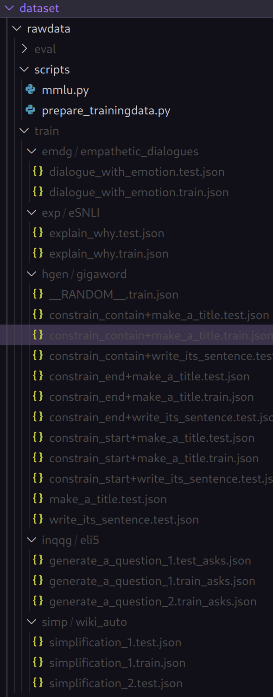

# ESCF-CFT
## Download training data
you can get training data from [this website.](https://drive.google.com/drive/folders/1aQmnPmYGoQIYPK5jgbv4K4PXYYNwqisH)  
this project will use these datasets below:
- empathetic_dialogues
- eSNL
- gigaword
- eli5
- wiki_auto

## Prepare training data
Place the data in the corresponding folders according to the diagram structure.



Run the Python script for preprocessing as follows:
``` python
cd dataset/rawdata/scripts/
python prepare_trainingdata.py
```

## Train model with 5 datasets
Please cd to the root directory of the project and then run the script.
\* **all bash scripts need run in root directory of the project**
```shell
bash scripts/train-on-5-instruction-task.sh
```

## Eval model on instruction tasks
Generate answer with base model and the tuned model
```shell
bash scripts/generate-pred-result.sh
```

Evaluate scores  
``` shell
bash scripts/evaluate-on-instruction-tasks.sh
```

## Evaluate model on general tasks
There are 3 sub-tasks in general tasks:
- Domain Knowledge
- Reasoning
- Reading Comperhension

Launch the eval scripts and change the sub-task that you need in this script
```shell
bash scripts/evaluate-on-general-tasks.sh
```

## plot results
plot results use python notebook `plot_results.ipynb` in the main path of this respo. 
